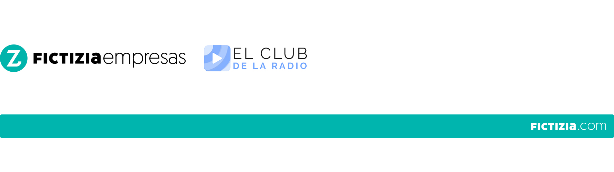

# Curso Incompany para [El Club de la Radio](https://www.elclubdelaradio.com/)
### Trabajando eficientemente como equipo y Automatizando el entorno con Nodejs

Sobre el Curso
=================
* Horario: Lunes a Viernes de 9h a 15h
* Fechas:
    * 24/03/2018
    * 14/04/2018

Teoría y Recursos
=================
Fecha | Teoría | Recursos | Contenido
------------ | ------------ | ------------- | -------------
24/03/2018 | [Clase 1](teoria/dia1.md) | [Clase 1](recursos/dia1.md) | Trabajando eficientemente como equipo
14/04/2018 | Clase 2 | Clase 2 | Automatizando el entorno con Nodejs

Temario
=================

**Parte 1: Trabajando eficientemente como equipo**
- Intro al entorno de trabajo del XXI
- El nuevo ecosistema y los nuevos flujos de trabajo
- Agile para un equipo de desarrollo
    - Filosofía ágil vs. cascada
    - Paradigmas y sistemas de gestión (scrum, xp...)
    - Adaptación al equipo
- Trabajo con Git y Github
    - Fundamentos de Git como control de versiones
    - Trabajando en ramas con Git
    - Separación de entornos
    - Github, como capa social
    - Gestionando el trabajo con Pull Request
    - Implementando Git Flow
    - Dividiendo el trabajo con Issues y milestones
    - Github project, para tener un Kanban

**Parte 2: Automatizando el entorno con Nodejs**
- Repaso a la asincronía con javascript
- Node.js  y su core
- Npm, Yarn y la gestión de paquetes
- Automatización de tareas con Gulp y NPM
- Scaffolding con Yeoman
- Intro a Arquitecturas no-monoliticas
    - Serverless
    - Microservicios y plataformas (Google Cloud)
